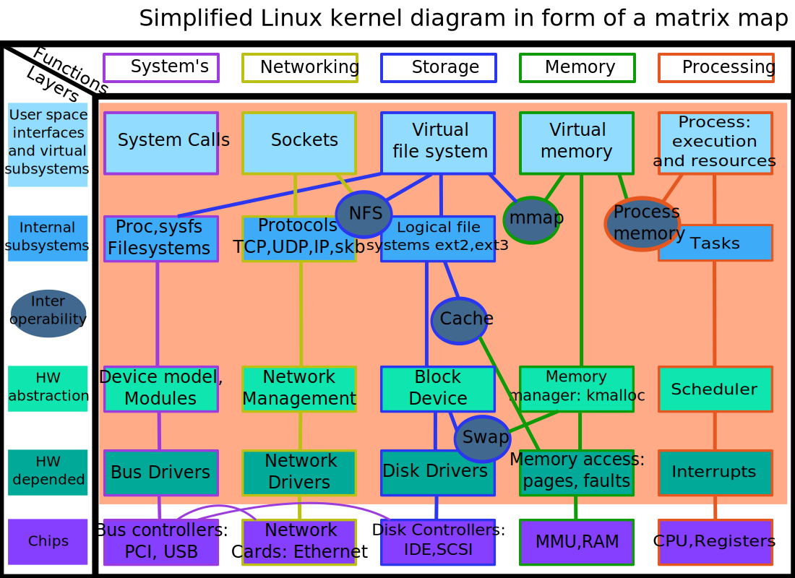
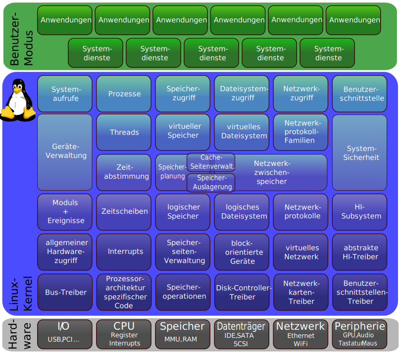

# {{ page.title }}

## 201.1 Kernel-Komponenten

### Aufbau des Kernels

Der Kernel-Aufbau wird durch folgende Grafik gut illustriert. Die Kernel-Komponenten befinden sich im orangenen Feld.
Die lilafarbenen Kästchen dadrunter stellen die Hardwarekomponenten da, mit denen der Kernel Daten austauscht.



Quelle: [https://upload.wikimedia.org/wikipedia/commons/c/cf/Linux_kernel_diagram.svg](https://upload.wikimedia.org/wikipedia/commons/c/cf/Linux_kernel_diagram.svg)



Quelle: [https://commons.wikimedia.org/wiki/File:Linux_Kernel_Struktur.svg](https://commons.wikimedia.org/wiki/File:Linux_Kernel_Struktur.svg)

Mit Komponenten sind vermutlich die Module gemeint. Module können zur Laufzeit nachgeladen und wieder entladen werden.

Mit `uname` holt man sich Informationen über den geladenen Kernel:

```
oliver.gaida@server$ uname --help
Aufruf: uname [OPTION]...
Bestimmte Systeminformationen ausgeben. Ohne OPTION dasselbe wie -s.

  -a, --all                alle Informationen ausgeben, in der folgenden
                             Reihenfolge (außer -p und -i, wenn nicht bekannt):
  -s, --kernel-name        Namen des Kernels ausgeben
  -n, --nodename           Netzwerknamen der Maschine ausgeben
  -r, --kernel-release     Release‐Nummer des Kernels ausgeben
  -v, --kernel-version     Kernelversion ausgeben
  -m, --machine            Maschinentyp (Hardware) ausgeben
  -p, --processor          Typ des Prozessors ausgeben (nicht portabel)
  -i, --hardware-platform  Hardwareplattform ausgeben (nicht portabel)
  -o, --operating-system   Namen des Betriebssystems ausgeben
      --help     diese Hilfe anzeigen und beenden
      --version  Versionsinformation anzeigen und beenden
```

mit `/usr/src/linux` ist ein sym-Link gemeint den man sich erstellen kann:

```
ln -s /usr/src/linux-headers-$(uname -r) /usr/src/linux

ls -l /usr/src
insgesamt 16
lrwxrwxrwx  1 root root   41 Mai 21 15:46 linux -> /usr/src/linux-headers-4.15.0-101-generic
drwxr-xr-x 25 root root 4096 Mai 20 06:19 linux-headers-4.15.0-101
drwxr-xr-x  8 root root 4096 Mai 20 06:19 linux-headers-4.15.0-101-generic
drwxr-xr-x 25 root root 4096 Apr 30 06:12 linux-headers-4.15.0-99
drwxr-xr-x  8 root root 4096 Apr 30 06:12 linux-headers-4.15.0-99-generic

ls -l /usr/src/linux/Documentation
lrwxrwxrwx 1 root root 41 Mai 11 11:08 /usr/src/linux/Documentation -> ../linux-headers-4.15.0-101/Documentation

ls -l /usr/src/linux-headers-4.15.0-101/Documentation
insgesamt 52
drwxr-xr-x 2 root root 4096 Mai 20 06:19 aoe
drwxr-xr-x 2 root root 4096 Mai 20 06:19 cdrom
drwxr-xr-x 2 root root 4096 Mai 20 06:19 EDID
drwxr-xr-x 2 root root 4096 Mai 20 06:19 features
drwxr-xr-x 3 root root 4096 Mai 20 06:19 filesystems
drwxr-xr-x 2 root root 4096 Mai 20 06:19 kbuild
-rw-r--r-- 1 root root 4570 Jan 28  2018 Makefile
drwxr-xr-x 2 root root 4096 Mai 20 06:19 media
drwxr-xr-x 2 root root 4096 Mai 20 06:19 s390
drwxr-xr-x 3 root root 4096 Mai 20 06:19 scsi
drwxr-xr-x 2 root root 4096 Mai 20 06:19 sphinx
drwxr-xr-x 3 root root 4096 Mai 20 06:19 trace
```


[HOME](./)
