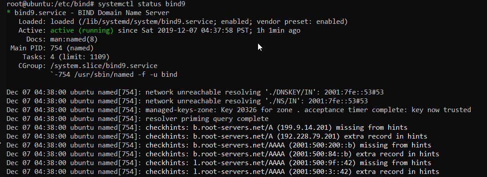

# {{ page.title }}

## 207.1 Grundlegende DNS-Serverkonfiguration

der Einfachheit halber bearbeite ich das Thema nur unter Ubuntu.

### Installation

```
apt-get install bind9
```

Damit hat man schon mal einen Cache-Only-Server.

```
root@ubuntu:/etc/bind# aptitude show bind9
Package: bind9
Version: 1:9.11.3+dfsg-1ubuntu1.11
State: installed
Automatically installed: no
Priority: optional
Section: net
Maintainer: Ubuntu Developers <ubuntu-devel-discuss@lists.ubuntu.com>
Architecture: amd64
Uncompressed Size: 1,918 k
Depends: adduser, bind9utils (= 1:9.11.3+dfsg-1ubuntu1.11), debconf (>= 0.5) | debconf-2.0, libbind9-160 (= 1:9.11.3+dfsg-1ubuntu1.11), libdns1100 (= 1:9.11.3+dfsg-1ubuntu1.11), libisc169 (= 1:9.11.3+dfsg-1ubuntu1.11), libisccc160 (=
         1:9.11.3+dfsg-1ubuntu1.11), libisccfg160 (= 1:9.11.3+dfsg-1ubuntu1.11), liblwres160 (= 1:9.11.3+dfsg-1ubuntu1.11), lsb-base (>= 3.2-14), net-tools, netbase, libc6 (>= 2.4), libcap2 (>= 1:2.10), libgeoip1, libjson-c3 (>= 0.11), libssl1.1 (>=
         1.1.0), libxml2 (>= 2.7.4), zlib1g (>= 1:1.1.4)
Suggests: bind9-doc, dnsutils, resolvconf, ufw
Conflicts: bind9:i386
Description: Internet Domain Name Server
 The Berkeley Internet Name Domain (BIND) implements an Internet domain name server.  BIND is the most widely-used name server software on the Internet, and is supported by the Internet Software Consortium, www.isc.org.

 This package provides the server and related configuration files.
Homepage: https://www.isc.org/downloads/bind/
```

### Konfigurationsdateien

```
root@ubuntu:/etc/bind# ls -l
total 52
-rw-r--r-- 1 root root 2761 Nov 18 07:01 bind.keys
-rw-r--r-- 1 root root  237 Sep 30 11:39 db.0
-rw-r--r-- 1 root root  271 Sep 30 11:39 db.127
-rw-r--r-- 1 root root  237 Sep 30 11:39 db.255
-rw-r--r-- 1 root root  353 Sep 30 11:39 db.empty
-rw-r--r-- 1 root root  270 Sep 30 11:39 db.local
-rw-r--r-- 1 root root 3171 Sep 30 11:39 db.root
-rw-r--r-- 1 root bind  463 Sep 30 11:39 named.conf
-rw-r--r-- 1 root bind  490 Sep 30 11:39 named.conf.default-zones
-rw-r--r-- 1 root bind  165 Sep 30 11:39 named.conf.local
-rw-r--r-- 1 root bind  890 Sep 30 11:39 named.conf.options
-rw-r----- 1 bind bind   77 Dec  1 03:40 rndc.key
-rw-r--r-- 1 root root 1317 Sep 30 11:39 zones.rfc1918
```

### Staten/Stoppen

Status:



Test:

```
root@ubuntu:/etc/bind# dig @localhost www.google.de +short
172.217.22.35
root@ubuntu:/etc/bind# systemctl stop bind9
root@ubuntu:/etc/bind# timeout 3 dig @localhost www.google.de +short || echo "Timeout"
Timeout
root@ubuntu:/etc/bind# systemctl start bind9
root@ubuntu:/etc/bind# timeout 3 dig @localhost www.google.de +short
172.217.22.35
```

### DNS-Abfragen durchführen

Es gibt drei Tools die man üblicher Weise dafür verwendet, das sind:

- `dig`
- `nslookup`
- `host`

Nun mal im einzelnen betrachtet...

#### dig

man page siehe [hier](./man/dig.html)

Ein paar gute Befehle laut [__cht.sh__](https://cht.sh/) sind:

```
# dig
# DNS Lookup utility.

# Lookup the IP(s) associated with a hostname (A records):
dig +short example.com

# Lookup the mail server(s) associated with a given domain name (MX record):
dig +short example.com MX

# Get all types of records for a given domain name:
dig example.com ANY

# Specify an alternate DNS server to query:
dig @8.8.8.8 example.com

# Perform a reverse DNS lookup on an IP address (PTR record):
dig -x 8.8.8.8

# Find authoritative name servers for the zone and display SOA records:
dig +nssearch example.com

# Perform iterative queries and display the entire trace path to resolve a domain name:
dig +trace example.com
```

```
dig +nssearch sycor.de
SOA dns1.sycor-world.de. dns.sycor.de. 2019120501 14400 2700 604800 86400 from server 194.31.240.5 in 13 ms.
SOA dns1.sycor-world.de. dns.sycor.de. 2019120501 14400 2700 604800 86400 from server 52.232.16.10 in 19 ms.
```

bei fogenden Befehl werden alle eventuell beteiligten DNS-Server aufgelistet:

- `.` die Root-Server
- `de.` die DNS-Server der Top-Level-Domain
- `sycor.de.` und letztlich die 3 DNS-Server die die Anfragen für sycor.de beantworten.

```
dig +trace sycor.de

; <<>> DiG 9.11.3-1ubuntu1.8-Ubuntu <<>> +trace sycor.de
;; global options: +cmd
.                       83416   IN      NS      j.root-servers.net.
.                       83416   IN      NS      k.root-servers.net.
.                       83416   IN      NS      c.root-servers.net.
.                       83416   IN      NS      e.root-servers.net.
.                       83416   IN      NS      m.root-servers.net.
.                       83416   IN      NS      a.root-servers.net.
.                       83416   IN      NS      b.root-servers.net.
.                       83416   IN      NS      i.root-servers.net.
.                       83416   IN      NS      l.root-servers.net.
.                       83416   IN      NS      d.root-servers.net.
.                       83416   IN      NS      g.root-servers.net.
.                       83416   IN      NS      h.root-servers.net.
.                       83416   IN      NS      f.root-servers.net.
.                       83416   IN      RRSIG   NS 8 0 518400 20191220050000 20191207040000 22545 . NFf4GZxnwB0p0DHhYwBGoJJqUYDzR+RNhbsLb130bcuuYoB8zqu5Sug8 uy0MLuRrMOJXZkOepifZFMct4UCPIAVpMKhxjXfrJqAA1uAupmoqvrIL zA93mrCLyFS36gosbSmJVHUBRlGKHu0IPq1LbV+Lpku+h4shbTYf+aOY nYWya/CgLnDHmqrPowKEG14BoVY6ve2zmCviQMTp3SSCjHZ3nSleQwsp l+usgjRwjFicr/WyCtc24JWKWdu9O6gscz7vvL311jXr8f4IKbRqCdRv Phw5oQw+5jMlBtixxi+go5riXSnD+Ylky3lFcZJTarL+/HKWG6ndaLty GC/Q8w==
;; Received 540 bytes from 192.168.2.2#53(192.168.2.2) in 2 ms

de.                     172800  IN      NS      a.nic.de.
de.                     172800  IN      NS      f.nic.de.
de.                     172800  IN      NS      l.de.net.
de.                     172800  IN      NS      n.de.net.
de.                     172800  IN      NS      s.de.net.
de.                     172800  IN      NS      z.nic.de.
de.                     86400   IN      DS      39227 8 2 AAB73083B9EF70E4A5E94769A418AC12E887FC3C0875EF206C3451DC 40B6C4FA
de.                     86400   IN      DS      45580 8 2 918C32E2F12211766BE6226674F447458F2259B9A0D87B44D29D55AF ECA6B2E1
de.                     86400   IN      RRSIG   DS 8 1 86400 20191220050000 20191207040000 22545 . gANYOTqNfBftwg3ww4NnaMCfxoGccAJPnKROICO1ME65Ym4dyPeDqgt8 Hb5PhpmDHJVsrsoKSGOjcIf4eDky9kj1xEJH2a3gBgbN3vwaykiZJCCE dqnfyobsH9Z5jtYd6GFjBy8Rc5TgiyNGk4HO2pKhY/KAZ9PoaJwGQadq idWQhI1j3kvVl+py/Nms4ba5j6ZjYzpp29tYpEeLKGbb6ybJBJQbzC5o GMtJhaJnCr2a8dzKNMDntx7XiZcUbzh2Ne91JKRA6I6ioV2Wyj3/pLtt 48PTSv5c8tobagMbKBRH+/YisdMHgmPxakvBVyvb+gsHgFXgZDJouO+e HYKqag==
;; Received 762 bytes from 198.97.190.53#53(h.root-servers.net) in 98 ms
                                                                                                                                                                                                                                                               sycor.de.               86400   IN      NS      dns1.sycor-world.de.
sycor.de.               86400   IN      NS      dns2.sycor-world.de.
sycor.de.               86400   IN      NS      dns3.sycorservice.de.
tdfdfid7qbdab7rh9s91pac2bbm049fd.de. 7200 IN NSEC3 1 1 15 AA102CDC4FC37336 TDFF7CJ55MR0J6LPMNN9O1NHN0BD6FH7  NS SOA RRSIG DNSKEY NSEC3PARAM
tdfdfid7qbdab7rh9s91pac2bbm049fd.de. 7200 IN RRSIG NSEC3 8 2 7200 20191219073814 20191205060814 18318 de. I9UovYzY6N6Km884RjB0Zo2/3LQsGCWuoYGO+ZpsbpTXwARGCy1Dit/W cEgzOCMicfbSfAf+/39L7yzbadSRclalJBMSReJA6ERDZG97UPik32Kd VM32AXomeB4giExSxE7RQ/xvJNvwhwijpvtGpf2bMrcrAjyvaTwvOTrC kK8=
l5kiqqnoqd92ippe7cao2cmid01remtg.de. 7200 IN NSEC3 1 1 15 AA102CDC4FC37336 L5KK2RMH3S7B10DL9FKKDC5M69H9I1FT  A RRSIG
l5kiqqnoqd92ippe7cao2cmid01remtg.de. 7200 IN RRSIG NSEC3 8 2 7200 20191219083637 20191205070637 18318 de. Vix5oorPFXxSrkbDYeVtm2kceJ3V3G1E6HdrJn60EhIWeiuo+edxRir1 23xlycC05oZh8YyZUPnwBHn2fISfQzpreQqyU0fztG2bB+eF6oJ7E3jt 4nT3j+zabbX+AtFB1yGwUVeI8RNtsqun5wrzNXpvPGrtW7Taba2YXceg y5w=
;; Received 666 bytes from 194.146.107.6#53(n.de.net) in 11 ms

sycor.de.               300     IN      A       194.31.240.6
sycor.de.               300     IN      NS      dns1.sycor-world.de.
sycor.de.               300     IN      NS      dns2.sycor-world.de.
sycor.de.               300     IN      NS      dns3.sycorservice.de.
;; Received 183 bytes from 52.232.16.10#53(dns3.sycorservice.de) in 18 ms
```

```
dig sycor.de MX +short
200 mx0092.ppsmtp.de.
100 mx0092.ppsmtp.com.
```

```
dig sycor.de NS +short
dns3.sycorservice.de.
dns2.sycor-world.de.
dns1.sycor-world.de.
```

#### nslookup

man page siehe [hier](./man/nslookup.html)

```
# nslookup
# Query name server(s) for various domain records.

# Query your system's default name server for an IP address (A record) of the domain:
nslookup example.com

# Query a given name server for a NS record of the domain:
nslookup -type=NS example.com 8.8.8.8

# Query for a reverse lookup (PTR record) of an IP address:
nslookup -type=PTR 54.240.162.118

# Query for ANY available records using TCP protocol:
nslookup -vc -type=ANY example.com

# Query a given name server for the whole zone file (zone transfer) of the domain using TCP protocol:
nslookup -vc -type=AXFR example.com name_server

# Query for a mail server (MX record) of the domain, showing details of the transaction:
nslookup -type=MX -debug example.com

# Query a given name server on a specific port number for a TXT record of the domain:
nslookup -port=port_number -type=TXT example.com name_server
```

```
nslookup -type=NS sycor.de 8.8.8.8
Server:         8.8.8.8
Address:        8.8.8.8#53

Non-authoritative answer:
sycor.de        nameserver = dns1.sycor-world.de.
sycor.de        nameserver = dns3.sycorservice.de.
sycor.de        nameserver = dns2.sycor-world.de.

Authoritative answers can be found from:
```

#### host

man page siehe [hier](./man/host.html)

```
# host
# Lookup Domain Name Server.

# Lookup A, AAAA, and MX records of a domain:
host domain

# Lookup a field (CNAME, TXT,...) of a domain:
host -t field domain

# Reverse lookup an IP:
host ip_address

# Specify an alternate DNS server to query:
host domain 8.8.8.8
```

```
host -t NS sycor.de 8.8.8.8
Using domain server:
Name: 8.8.8.8
Address: 8.8.8.8#53
Aliases:

sycor.de name server dns2.sycor-world.de.
sycor.de name server dns3.sycorservice.de.
sycor.de name server dns1.sycor-world.de.
```

### Info

Der Cache-Only-DNS hat die Infos, wer denn Root-Server also für `.` ist, bei uns aus der Datei `/etc/bind/db.root`

```
root@ubuntu:/etc/bind# grep -Pv '^;' /etc/bind/db.root | grep -P '.*\d\s+A\s+'
A.ROOT-SERVERS.NET.      3600000      A     198.41.0.4
B.ROOT-SERVERS.NET.      3600000      A     192.228.79.201
C.ROOT-SERVERS.NET.      3600000      A     192.33.4.12
D.ROOT-SERVERS.NET.      3600000      A     199.7.91.13
E.ROOT-SERVERS.NET.      3600000      A     192.203.230.10
F.ROOT-SERVERS.NET.      3600000      A     192.5.5.241
G.ROOT-SERVERS.NET.      3600000      A     192.112.36.4
H.ROOT-SERVERS.NET.      3600000      A     198.97.190.53
I.ROOT-SERVERS.NET.      3600000      A     192.36.148.17
J.ROOT-SERVERS.NET.      3600000      A     192.58.128.30
K.ROOT-SERVERS.NET.      3600000      A     193.0.14.129
L.ROOT-SERVERS.NET.      3600000      A     199.7.83.42
M.ROOT-SERVERS.NET.      3600000      A     202.12.27.33
```

diese Datei ist über die Hauptkonfigurations-Datei `/etc/bind/named.conf` per `include` indirect eingebunden:

```
root@ubuntu:/etc/bind# cat named.conf | grep -vP '^(//.*|\s*)$'
include "/etc/bind/named.conf.options";
include "/etc/bind/named.conf.local";
include "/etc/bind/named.conf.default-zones";
root@ubuntu:/etc/bind# head -6 /etc/bind/named.conf.default-zones
// prime the server with knowledge of the root servers
zone "." {
        type hint;
        file "/etc/bind/db.root";
};
```

### Anpassungen

Erreichbar ist der Server nur von lokal :

```
root@ubuntu:/etc/bind# netstat -tulpn | grep 'tcp.*:53.*named'
tcp        0      0 127.0.0.1:53            0.0.0.0:*               LISTEN      2335/named
tcp6       0      0 :::53                   :::*                    LISTEN      2335/named
```

Das ändern wir nun mit einem neuen Eintrag in der Datei `/etc/bind/named.conf.options`:

```
root@ubuntu:/etc/bind# grep 'listen.*53' /etc/bind/named.conf.options
        listen-on port 53 { 10.191.17.9; 127.0.0.1; };
root@ubuntu:/etc/bind# rndc reload
server reload successful
root@ubuntu:/etc/bind# netstat -tulpn | grep 'tcp.*:53.*named'
tcp        0      0 10.191.17.9:53          0.0.0.0:*               LISTEN      2335/named
tcp        0      0 127.0.0.1:53            0.0.0.0:*               LISTEN      2335/named
tcp6       0      0 :::53                   :::*                    LISTEN      2335/named
```

Die man-page zu `named.conf` findest Du [hier](./man/named.conf.html).

Man kann hier explizit angeben, wer den DNS-Server anfragen darf, mit:

```
// jeder darf
allow-query { any; };
// oder nur der lokale Server
allow-query { localhost; };
// Maschinen mit den beiden folgenden IP-Adressen dürfen Anfragen stellen:
allow-query { 127.0.0.1; 10.191.17.1; };
```

Nun stelle ich einen Forwarder ein in `/etc/bind/named.conf.options`:

```
options {
        ...
        forwarders { 52.232.16.10; };
}
```

### Konfiguration neu laden

Es gibt 3 Varianten:

```bash
# 1
kill -HUP `pidof named`
# 2
rndc reload
# 3
systemctl restart named
```

### Parameter für `rndc`

[__man rncd__](./man/rndc.html)

| Parameter         | Beschreibung                                                      |
| ----------------- | ----------------------------------------------------------------- |
| reload            | conf- und zone-file neu einlesen                                  |
| reload <zone>     | ein Zone neu einlesen                                             |
| retransfer <zone> | Erneutes übertragen der angegebenen Slave-Zone vom Master-Server. |

[HOME](./)
