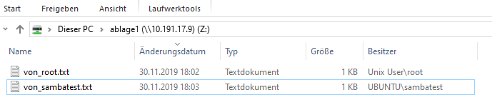

# {{ page.title }}

## 209.1 Samba-Server-Konfiguration

Kandidaten sollten einen Samba-Server für verschiedene Clients einrichten können. Dieses Lernziel umfasst die Konfiguration von Samba als Standalone-Server sowie die Integration von Samba als Mitglied eines Active Directory. Ferner abgedeckt ist die Konfiguration eines einfachen CIFS und Druckerfreigaben. Auch die Konfiguration eines Linux-Clients zum Zugriff auf einen Samba-Server wird geprüft. Fehlersuche in Installationen wird ebenfalls geprüft.

**Hauptwissensgebiete:**
-   Dokumentation von Samba 4
-   Konfigurationsdateien von Samba 4
-   Werkzeuge, Hilfsprogramme und Daemons von Samba 4
-   Mounten von CIFS-Shares unter Linux
-   Abbilden von Windows- auf Linux-Benutzernamen
-   User-Level, Share-Level und AD-Sicherheit

**Dies ist eine auszugsweise Liste der verwendeten Dateien, Begriffe und
Hilfsprogramme:**
-   smbd, nmbd, winbindd
-   smbcontrol, smbstatus, testparm, smbpasswd, nmblookup
-   samba-tool
-   net
-   smbclient
-   mount.cifs
-   /etc/samba/
-   /var/log/samba/


### man-pages

- [manpage von smbcontrol](./man/smbcontrol.html)
- [manpage von smbstatus](./man/smbstatus.html)
- [manpage von testparm](./man/testparm.html)
- [manpage von smbpasswd](./man/smbpasswd.html)
- [manpage von nmblookup](./man/nmblookup.html)

### Installation

Ich installiere das nur auf Ubuntu.

- samba-common (Basiswerkzeuge von Samba wie smbpasswd )
- samba (der Samba Server)

```bash
sudo apt-get install samba-common samba
```

### Konfiguration

#### Test-User anlegen

Nun lege ich mir erstmal einen User an:

```bash
# im System
useradd -m -s /bin/bash sambatest
passwd sambatest
  Enter new UNIX password:
  Retype new UNIX password:
  passwd: password updated successfully
# in Samba
smbpasswd -a sambatest
  New SMB password:
  Retype new SMB password:
  Added user sambatest.
```

weitere `smbpasswd` Kommandos sind:

```bash
sudo smbpasswd -x USERNAME # Entfernt den Benutzer USERNAME aus der Samba Datenbank
sudo smbpasswd -d USERNAME # Deaktiviert den Benutzer USERNAME in der Datenbank
sudo smbpasswd -e USERNAME # Aktiviert den vorher deaktivierten Benutzer USERNAME in der Datenbank wieder
```

#### Samba-Freigabe einrichten

Abgesehen vom anlegen des Verzeichnisses, geschiet das über die Datei `/etc/samba/smb.conf`.

```
mkdir -p /data/ablage1
```

in die Datei `/etc/samba/smb.conf` wurde folgender Abschnitt eingefügt:

```ini
[ablage1]
path = /data/ablage1
public = yes
writeable = yes
```

Aktivieren mit :

```
smbcontrol smbd reload-config
```

#### Portfreischaltungen

schauen wir uns mal unsere aktuellen Ports an, auf die unser System lauscht:

```
netstat -tulpn
Active Internet connections (only servers)
Proto Recv-Q Send-Q Local Address           Foreign Address         State       PID/Program name
tcp        0      0 127.0.0.53:53           0.0.0.0:*               LISTEN      625/systemd-resolve
tcp        0      0 0.0.0.0:22              0.0.0.0:*               LISTEN      785/sshd
tcp        0      0 0.0.0.0:445             0.0.0.0:*               LISTEN      2017/smbd
tcp        0      0 0.0.0.0:139             0.0.0.0:*               LISTEN      2017/smbd
tcp6       0      0 :::80                   :::*                    LISTEN      864/apache2
tcp6       0      0 :::22                   :::*                    LISTEN      785/sshd
tcp6       0      0 :::445                  :::*                    LISTEN      2017/smbd
tcp6       0      0 :::139                  :::*                    LISTEN      2017/smbd
udp        0      0 127.0.0.53:53           0.0.0.0:*                           625/systemd-resolve
udp        0      0 10.0.2.15:68            0.0.0.0:*                           587/systemd-network
udp        0      0 10.0.2.255:137          0.0.0.0:*                           2092/nmbd
udp        0      0 10.0.2.15:137           0.0.0.0:*                           2092/nmbd
udp        0      0 0.0.0.0:137             0.0.0.0:*                           2092/nmbd
udp        0      0 10.0.2.255:138          0.0.0.0:*                           2092/nmbd
udp        0      0 10.0.2.15:138           0.0.0.0:*                           2092/nmbd
udp        0      0 0.0.0.0:138             0.0.0.0:*                           2092/nmbd
```

`smdb` und `nmdb` kommen von unserer Samba-Installation. Folgendes Kommando filtert unsere benötigen Ports:

```
netstat -tulpn | grep mbd | grep tcp | awk  '{print $4}' |awk -F: '{print $NF}'\
 | sort | uniq | ruby -e 'puts ARGF.read.split(/\n/).join(",")'
139,445
netstat -tulpn | grep mbd | grep udp | awk  '{print $4}' |awk -F: '{print $NF}'\
 | sort | uniq | ruby -e 'puts ARGF.read.split(/\n/).join(",")'
137,138
```

Also werden eingehende Verbindungen über `tcp` auf Port 139 und 445 erwartet und über `upd` auf Port 137 und 138.

Weiterhin ist zu erkennen, dass `smbd` rein über das TCP-Protokoll geht und die Ports 139 und 445 verwendet. Und `nmbd` nur das
UDP-Protokoll verwendet über die Ports 137 und 138.

### Share einbinden und verwenden, Rechte richtig setzen

Stattdessen habe ich meiner VM noch eine Hostonly-Adresse gegeben: 10.191.17.9. Damit ich das Share über meinen Windows-Host einbinden konnte:

```
C:\Users\gaida>net use z: \\10.191.17.9\ablage1 /U:10.191.17.9\sambatest
Das Kennwort oder der Benutzername ist ungültig für \\10.191.17.9\ablage1.

Geben Sie das Kennwort für "10.191.17.9\sambatest" ein, um eine Verbindung mit "10.191.17.9" herzustellen:
Der Befehl wurde erfolgreich ausgeführt.
```



auf dem Ubuntu sieht es nun wie folgt aus:

```
root@ubuntu:/data# ls -ld ablage1/
drwxrwxrwx 2 root root 4096 Nov 30 09:06 ablage1/
root@ubuntu:/data/ablage1# ls -l
total 8
-rwxr--r-- 1 sambatest sambatest 13 Nov 30 09:03 123.txt
-rw-rw-rw- 1 root      root      10 Nov 30 09:02 test.txt
```

Die Rechte sind nun noch nicht besonders gelungen. Der User sambatest kann hier zwar schreiben, aber auch alle anderen Systemuser. Schöner wäre es, eine Gruppe zu haben, über die auch die Rechte der System-User als auch der Samba-User sinnvoll gesetzt sind.

Zu diesem Zweck lege ich eine neue Gruppe `ablage1` an, und mache den `sambatest` User zum Mitglied dieser Gruppe.

```bash
root@ubuntu:/data/ablage1# addgroup ablage1
Adding group 'ablage1' (GID 1003) ...
Done.
root@ubuntu:/data/ablage1# groups sambatest
sambatest : sambatest
root@ubuntu:/data/ablage1# usermod -G ablage1 sambatest
root@ubuntu:/data/ablage1# groups sambatest
sambatest : sambatest ablage1
```

Weiterhin lege ich nun einen weiteren Samba-User an, der die gleichen Rechte wie der erste bekommen soll:

```
root@ubuntu:/data# useradd -m -s /bin/bash sambatest2
root@ubuntu:/data# passwd sambatest2
Enter new UNIX password:
Retype new UNIX password:
passwd: password updated successfully
root@ubuntu:/data# smbpasswd -a sambatest2
New SMB password:
Retype new SMB password:
Added user sambatest2.
root@ubuntu:/data# usermod -G ablage1 sambatest2
root@ubuntu:/data# grep ablage1 /etc/group
ablage1:x:1003:sambatest,sambatest2
```

Nun ordne ich der neuen Gruppe das Verzeichnis zu und entferne die Rechte für alle User:

```
root@ubuntu:/data# chgrp ablage1 ablage1/
root@ubuntu:/data# chmod o-rwx ablage1/
root@ubuntu:/data# ls -dl ablage1/
drwxrwx--- 2 root ablage1 4096 Nov 30 09:06 ablage1/
```

zum Test nun noch ein weiterer Samba-User der nicht Mitglied dieser Gruppe wird:

```
root@ubuntu:~# useradd -m -s /bin/bash sambatest3
root@ubuntu:~# passwd sambatest3
Enter new UNIX password:
Retype new UNIX password:
passwd: password updated successfully
root@ubuntu:~# smbpasswd -a sambatest3
New SMB password:
Retype new SMB password:
Added user sambatest3.
root@ubuntu:~# su - sambatest3
sambatest3@ubuntu:~$ ls -l /data/ablage1/
ls: cannot open directory '/data/ablage1/': Permission denied
```

Wie wir sehen komm der System-User `sambatest3` nicht an die Dateien. Hingegen kann der System-User `sambatest2`
gut damit arbeiten:

```
root@ubuntu:~# su - sambatest2
sambatest2@ubuntu:~$ ls -l /data/ablage1/
total 8
-rw-rw-rw- 1 root      root      10 Nov 30 09:02 von_root.txt
-rwxr--r-- 1 sambatest sambatest 13 Nov 30 09:03 von_sambatest.txt
sambatest2@ubuntu:~$ echo 123 > von_sambatest2.txt
sambatest2@ubuntu:~$ ls -l
total 4
-rw-rw-r-- 1 sambatest2 sambatest2 4 Nov 30 09:33 von_sambatest2.txt
sambatest2@ubuntu:~$ chgrp ablage1 von_sambatest2.txt
sambatest2@ubuntu:~$ ls -l
total 4
-rw-rw-r-- 1 sambatest2 ablage1 4 Nov 30 09:33 von_sambatest2.txt
```

Was aber wenn sambatest2 die eine Datei von einem Windows-Rechner aus anlegt. Dann kann er nicht die Gruppe ändern und der User sambatest kann in die Datei nicht schreiben.

Frage: Wie setze ich die default-Group für neue Dateien in einem samba-share?

Lösung: Das geht über die `force group` Direktive, die man in der smb.conf im Freigabe-Abschnitt setzt.Das ganze ist in der man-page von `smb.conf` erläutert.

Also:

```
[ablage1]
path = /data/ablage1
public = yes
writeable = yes
force group = ablage1
```

Diese Änderung wird sofort nach dem Kommando `smbcontrol smbd reload-config` aktiv.

### `net` Kommandos

```
root@ubuntu:/data/ablage1# net status shares

Service      pid     machine       Connected at
-------------------------------------------------------
ablage1      1417   10.191.17.1   Sat Nov 30 08:56:57 2019
```

### Kommando `smbstatus`

Berichtet über den aktuellen Sambastatus:

```
root@ubuntu:~# smbstatus

Samba version 4.7.6-Ubuntu
PID     Username     Group        Machine                                   Protocol Version  Encryption           Signing
----------------------------------------------------------------------------------------------------------------------------------------

Service      pid     Machine       Connected at                     Encryption   Signing
---------------------------------------------------------------------------------------------

No locked files
```

Da ist nicht viel los. Dann verbinde ich mich mal auf mein Share:

```
C:\Users\gaida>net use z: \\10.191.17.9\ablage1 /U:10.191.17.9\sambatest
Geben Sie das Kennwort für "10.191.17.9\sambatest" ein, um eine Verbindung mit "10.191.17.9" herzustellen:
Der Befehl wurde erfolgreich ausgeführt.
```

Und jetzt?

```
root@ubuntu:~# smbstatus

Samba version 4.7.6-Ubuntu
PID     Username     Group        Machine                                   Protocol Version  Encryption           Signing
----------------------------------------------------------------------------------------------------------------------------------------
2679    sambatest    sambatest    10.191.17.1 (ipv4:10.191.17.1:52955)      SMB3_11           -                    partial(AES-128-CMAC)

Service      pid     Machine       Connected at                     Encryption   Signing
---------------------------------------------------------------------------------------------
ablage1      2679    10.191.17.1   Sa Jan 11 10:24:38 2020 CET      -            -
IPC$         2679    10.191.17.1   Sa Jan 11 10:24:38 2020 CET      -            -

Locked files:
Pid          Uid        DenyMode   Access      R/W        Oplock           SharePath   Name   Time
--------------------------------------------------------------------------------------------------
2679         1002       DENY_NONE  0x80        RDONLY     NONE             /data/ablage1   .   Sat Jan 11 10:24:38 2020

```

### Kommando `smbmount`

weiß nicht genau, ob das noch relevant istm, aber laut [http://lpic2.unix.nl/ch10.html](http://lpic2.unix.nl/ch10.html) schon.

Da ich zu diesem Thema auf den aktuellen Distributionen nicht mehr viel machen kann, da kein smbmount mehr verfügbar ist. Kopiere ich den Inhalt von [http://lpic2.unix.nl/ch10.html](http://lpic2.unix.nl/ch10.html) :

```
smbmount
NOTE: Even though smbmount has been abandoned by most major Linux distributions in favor of mount.cifs you can still expect questions about smbmount during your LPIC2 exam.

Even as smbmount was maintained by the Samba community is was not a part of the core samba-client packages. The “smbfs” package contains the smbmount command and must be installed to be able to use smbmount.

smbmount is used to mount file systems shared over SMB. Most probably these file systems are found on Windows systems and shared with Linux systems with SMB client software installed. smbmount is the command line utility for mounting SMB file systems. For a more permanent implementation the smbfs is available for use in /etc/fstab.

Both methods to mount SMB file systems accept options to determine how the file system is mounted. The most common options are listed here:

username
Define username for authentication of the SMB session.

password
Define password for authentication of the SMB session.

credentials
This option points to a file containing a username and password. Use of this option is prefered over using the username and password in the command line options or in /etc/fstab. This file must have proper protection so only the user and/or root can read it.

	username=value
	password=value

uid
Define UID used for the local representation of the files on the mounted file system.

gid
Define GID used for the local representation of the files on the mounted file system.

fmask
Define permissions of remote files in the local representation of the mounted file system. This doesn't affect the actual permissions on the remote server.

Important: The name of the option is deceptive. It's not a mask but the actual permissions that is defined.

dmask
Define permissions of remote directories in the local representation of the mounted file system. This doesn't affect the actual permissions on the remote server.

Important: The name of the option is deceptive. It's not a mask but the actual permissions that is defined.

rw/ro
Mount the filesystem read-write or read-only.

Example command line usage:

	smbmount //windows/winshare2 /opt/winshare2 -o \
		username=alice.jones,password=Alice,uid=nobody,gid=nobody,fmask=775,dmask=775,rw,hard

Example of /etc/fstab usage:

	//windows/winshare2 /opt/winshare2 smbfs \
		username=alice.jones,password=Alice,uid=nobody,gid=nobody,fmask=775,dmask=775,rw,hard ://windows/winshare2 0 0
```

### user auflisten

Hier habe ich das Kommando `pdbedit -L -v` gefunden (auf [https://superuser.com/questions/271034/list-samba-users](https://superuser.com/questions/271034/list-samba-users))

```
---------------
Unix username:        sambatest
NT username:
Account Flags:        [U          ]
User SID:             S-1-5-21-3999205194-799000537-2371331654-1000
Primary Group SID:    S-1-5-21-3999205194-799000537-2371331654-513
Full Name:
Home Directory:       \\ubuntu\sambatest
HomeDir Drive:
Logon Script:
Profile Path:         \\ubuntu\sambatest\profile
Domain:               UBUNTU
Account desc:
Workstations:
Munged dial:
Logon time:           0
Logoff time:          Mi, 06 Feb 2036 16:06:39 CET
Kickoff time:         Mi, 06 Feb 2036 16:06:39 CET
Password last set:    Sa, 30 Nov 2019 12:40:55 CET
Password can change:  Sa, 30 Nov 2019 12:40:55 CET
Password must change: never
Last bad password   : 0
Bad password count  : 0
Logon hours         : FFFFFFFFFFFFFFFFFFFFFFFFFFFFFFFFFFFFFFFFFF
---------------
Unix username:        sambatest3
NT username:
Account Flags:        [U          ]
User SID:             S-1-5-21-3999205194-799000537-2371331654-1002
Primary Group SID:    S-1-5-21-3999205194-799000537-2371331654-513
Full Name:
Home Directory:       \\ubuntu\sambatest3
HomeDir Drive:
Logon Script:
Profile Path:         \\ubuntu\sambatest3\profile
Domain:               UBUNTU
Account desc:
Workstations:
Munged dial:
Logon time:           0
Logoff time:          Mi, 06 Feb 2036 16:06:39 CET
Kickoff time:         Mi, 06 Feb 2036 16:06:39 CET
Password last set:    Sa, 30 Nov 2019 18:31:44 CET
Password can change:  Sa, 30 Nov 2019 18:31:44 CET
Password must change: never
Last bad password   : 0
Bad password count  : 0
Logon hours         : FFFFFFFFFFFFFFFFFFFFFFFFFFFFFFFFFFFFFFFFFF
---------------
Unix username:        sambatest2
```

### mounten mit cifs

das mache ich mal von dem centos aus. Dazu die cifs Paket installieren und ein Verzeichnis zum mounten anlegen:

```
[root@centos ~]# yum install cifs-utils
mkdir /root/ablage1
```

Nun mounten:

```
[root@centos ~]# mount -t cifs -o user=sambatest2,domain=10.191.17.9 //10.191.17.9/ablage1 /root/ablage1
Password for sambatest2@//10.191.17.9/ablage1:  ********************************************************
[root@centos ~]# ls -l /root/ablage1/
total 11264
-rwxr-xr-x. 1 root root 4276224 Nov 30 19:40 core
-rwxr-xr-x. 1 root root       0 Nov 30 19:40 Neues Textdokument.txt
-rwxr-xr-x. 1 root root       8 Nov 30 17:39 noch eine von sambatest.txt
-rwxr-xr-x. 1 root root       3 Nov 30 19:41 test55
-rwxr-xr-x. 1 root root       4 Nov 30 17:41 von_nur_lesen_fuer_andere_sambatest2.txt
-rwxr-xr-x. 1 root root      13 Nov 30 17:39 von_root.txt
-rwxr-xr-x. 1 root root      11 Nov 30 17:41 von_sambatest2.txt
-rwxr-xr-x. 1 root root      21 Nov 30 17:39 von_sambatest.txt
```

Wie sieht es jetzt mit dem smbstatus aus?

```
root@ubuntu:~# smbstatus

Samba version 4.7.6-Ubuntu
PID     Username     Group        Machine                                   Protocol Version  Encryption           Signing
----------------------------------------------------------------------------------------------------------------------------------------
2679    sambatest    sambatest    10.191.17.1 (ipv4:10.191.17.1:52955)      SMB3_11           -                    partial(AES-128-CMAC)
3722    sambatest    sambatest    10.191.17.1 (ipv4:10.191.17.1:54275)      SMB3_11           -                    partial(AES-128-CMAC)
3724    sambatest2   sambatest2   10.191.17.6 (ipv4:10.191.17.6:41340)      SMB3_02           -                    partial(AES-128-CMAC)

Service      pid     Machine       Connected at                     Encryption   Signing
---------------------------------------------------------------------------------------------
ablage1      3722    10.191.17.1   Sa Jan 11 11:07:10 2020 CET      -            -
ablage1      2679    10.191.17.1   Sa Jan 11 10:24:38 2020 CET      -            -
IPC$         3724    10.191.17.6   Sa Jan 11 11:09:10 2020 CET      -            -
ablage1      3724    10.191.17.6   Sa Jan 11 11:09:10 2020 CET      -            -

Locked files:
Pid          Uid        DenyMode   Access      R/W        Oplock           SharePath   Name   Time
--------------------------------------------------------------------------------------------------
2679         1002       DENY_NONE  0x80        RDONLY     NONE             /data/ablage1   .   Sat Jan 11 10:24:38 2020
3722         1002       DENY_NONE  0x80        RDONLY     NONE             /data/ablage1   .   Sat Jan 11 11:07:10 2020
```

### Kommando `testparm`

Das Kommando überprüft die Syntax der `smb.conf`

Wichtig Optionen:

- `-s` Print service definitions without prompting for a carriage return
- `-v` List all options; by default only the ones specified in smb.conf are listed

```
root@ubuntu:~# testparm
Load smb config files from /etc/samba/smb.conf
rlimit_max: increasing rlimit_max (1024) to minimum Windows limit (16384)
WARNING: The "syslog" option is deprecated
Processing section "[printers]"
Processing section "[print$]"
Processing section "[ablage1]"
Loaded services file OK.
Server role: ROLE_STANDALONE

Press enter to see a dump of your service definitions

# Global parameters
[global]
        dns proxy = No
        log file = /var/log/samba/log.%m
        map to guest = Bad User
        max log size = 1000
        obey pam restrictions = Yes
        pam password change = Yes
        panic action = /usr/share/samba/panic-action %d
        passwd chat = *Enter\snew\s*\spassword:* %n\n *Retype\snew\s*\spassword:* %n\n *password\supdated\ssuccessfully* .
        passwd program = /usr/bin/passwd %u
        server role = standalone server
        server string = %h server (Samba, Ubuntu)
        syslog = 0
        unix password sync = Yes
        usershare allow guests = Yes
        idmap config * : backend = tdb
        inherit acls = Yes
        store dos attributes = Yes
        vfs objects = acl_xattr


[printers]
        browseable = No
        comment = All Printers
        create mask = 0700
        path = /var/spool/samba
        printable = Yes


[print$]
        comment = Printer Drivers
        path = /var/lib/samba/printers


[ablage1]
        force group = ablage1
        guest ok = Yes
        path = /data/ablage1
        read only = No
```


Nun baue ich mal absichtlich einen Fehler in die Konfiguration ein:

```
[printers]
   comment = All Printers
   browseable = nö
   path = /var/spool/samba
```

Wenn ich den test nun mit -s (Eingabe wird unterdrückt) aufrufe kommt nun folgender Fehler und der Returncode von `testparm` ist größer `0`:

```
root@ubuntu:~# vi /etc/samba/smb.conf
root@ubuntu:~# testparm -s
Load smb config files from /etc/samba/smb.conf
rlimit_max: increasing rlimit_max (1024) to minimum Windows limit (16384)
WARNING: The "syslog" option is deprecated
Processing section "[printers]"
set_variable_helper(nö): value is not boolean!
Error loading services.
root@ubuntu:~# echo $?
1
```

Das ist dann doch sehr hilfreich, da man direkt über der Zeile mit dem Wort `Error` die Fehlerbeschreibung lesen kann.

Ich baue den Fehler aus und rufe diese Testprogramm nun so auf, dass es mir sofort anzeigt, ob die Einstellungen brauchbar sind:

```
root@ubuntu:~# testparm -s > /dev/null && echo samba config ok
Load smb config files from /etc/samba/smb.conf
rlimit_max: increasing rlimit_max (1024) to minimum Windows limit (16384)
WARNING: The "syslog" option is deprecated
Processing section "[printers]"
Processing section "[print$]"
Processing section "[ablage1]"
Loaded services file OK.
Server role: ROLE_STANDALONE

samba config ok
```

### Kommando `smbpasswd`

#### Verwendung

Zum ändern des SMB-Kennwortes eines Benutzers. Standardmäßig (bei Ausführung ohne Argumente) versucht `smbpasswd`, das SMB-Kennwort des aktuellen Benutzers auf dem lokalen Computer zu ändern. Dies ähnelt der Funktionsweise des Programms passwd (1). Wenn es von root ausgeführt wird, kann es verwendet werden, um Benutzerkonten im konfigurierten Passwort-Backend zu verwalten. Beachten Sie, dass dieses Dienstprogramm zwar `smbpasswd` heißt, die Änderungen jedoch nicht unbedingt in die `smbpasswd`-Datei schreibt. `smbpasswd` funktioniert auf dem in smb.conf konfigurierten passdb-Backend.

Ich verwende aktuell `tdbsam`:

```
root@ubuntu:/etc/samba# grep passdb /etc/samba/smb.conf
   passdb backend = tdbsam
```

#### die wichtigsten Parameter und Syntax

Syntax:

```
# als root:
smbpasswd [options] [username]

# als ordinary user:
smbpasswd [options]
```

wichtige Parameter:

- `-a` neuen User der User-DB hinzufügen
- `-x` User aus der User-DB entfernen

#### Accountdatenbanken

Es gibt 3:

- smbpasswd
- tdbsam
- ldapsam

Empfohlen wird ldapsam, Erläuterungen dazu unter (http://lpic2.unix.nl/ch10.html#passdb_backend)[http://lpic2.unix.nl/ch10.html#passdb_backend].


### Kommando `nmblookup`

Wird verwendet, um NetBIOS-Namen abzufragen und sie mit NetBIOS über TCP / IP-Abfragen IP-Adressen in einem Netzwerk zuzuordnen. Mit den Optionen dieses Befehls können die Namensabfragen an einen bestimmten IP-Broadcast-Bereich oder an einen bestimmten Computer gerichtet werden. Alle Abfragen erfolgen über UDP.

Nützliche Parameter sind:

- `-M` sucht den **master browser**
- `-R` Rekursion. Wenn Sie mit nmblookup einen WIINS-Server mit der UNICAST-Befehlszeilenoption direkt abfragen, ist eine Rekursion erforderlich, damit der WINS-Server auf Abfragen reagiert, die sich nicht auf seinen eigenen NetBIOS-Namen oder seine IP-Adresse beziehen. Ohne eingestellte Rekursion antwortet der WINS-Server nur mit seinem eigenen NetBIOS-Namen.
- `-U <unicast address>` Sendet die Abfrage an die angegebene UNICAST-Adresse (eines WINS-Servers). Beispiel: `nmblookup -R -U 10.10.10.2 clientname`


[HOME](./)
