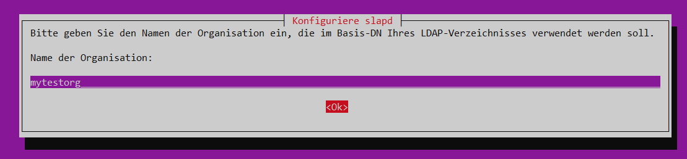

# {{ page.title }}

## 210.4 Einen OpenLDAP-Server konfigurieren

Kandidaten sollen einen einfachen OpenLDAP-Server konfigurieren können. Dies umfasst auch Wissen über das Datenformat LDIF und grundlegende Zugriffskontrolle.

**Hauptwissensgebiete:**
-   OpenLDAP
-   Verzeichnisbasierte Konfiguration
-   Zugriffskontrolle
-   Distinguished Names
-   Changetype-Operationen
-   Schemas und Whitepages
-   Verzeichnisse
-   Objekt-IDs, Attribute und Klassen

**Dies ist eine auszugsweise Liste der verwendeten Dateien, Begriffe und
Hilfsprogramme:**
-   slapd
-   slapd-config
-   LDIF
-   slapadd
-   slapcat
-   slapindex
-   /var/lib/ldap/
-   loglevel


### Installation von OpenLDAP auf Ubuntu 18.04

```
root@ubuntu:~# apt-get install  ldap-utils slapd
```

Bemerkung: das Paket `ldap-server` wird über das Paket `slapd` mit eingebunden.

```
root@ubuntu:~# aptitude show ldap-server
...
Description: OpenLDAP server (slapd)
 This is the OpenLDAP (Lightweight Directory Access Protocol) server (slapd). The server can be used to provide a standalone directory service.
Homepage: http://www.openldap.org/
```

Die Installationsroutine des sldap-Server fragt nach dem Administrator-Passwort:


Nach der Installation sind folgende Executables zu finden:

```
root@ubuntu:~# find /usr/ -iregex '.*\/ldap.*' -type f -executable -print
/usr/bin/ldapwhoami
/usr/bin/ldapexop
/usr/bin/ldapcompare
/usr/bin/ldappasswd
/usr/bin/ldapdelete
/usr/bin/ldapurl
/usr/bin/ldapsearch
/usr/bin/ldapmodify
/usr/bin/ldapmodrdn
/usr/share/doc/samba/examples/LDAP/get_next_oid
root@ubuntu:~# find /usr/ -iregex '.*/slap.*' -type f -executable -print
/usr/sbin/slapcat
/usr/sbin/slappasswd
/usr/sbin/slapacl
/usr/sbin/slapd
/usr/sbin/slapindex
/usr/sbin/slapauth
/usr/sbin/slapdn
/usr/sbin/slaptest
/usr/sbin/slapschema
/usr/sbin/slapadd
/usr/share/slapd/ldiftopasswd
```

Läuft der schon?

```
root@ubuntu:~# ps aux |grep slapd
openldap  1537  0.0  0.5 1260976 5364 ?        Ssl  00:53   0:00 /usr/sbin/slapd -h ldap:/// ldapi:/// -g openldap -u openldap -F /etc/ldap/slapd.d
root      2196  0.0  0.1  15056  1032 pts/0    S+   01:07   0:00 grep --color=auto slapd
root@ubuntu:~# netstat -anp |grep slapd
tcp        0      0 0.0.0.0:389             0.0.0.0:*               LISTEN      1537/slapd
tcp6       0      0 :::389                  :::*                    LISTEN      1537/slapd
unix  2      [ ACC ]     STREAM     LISTENING     25505    1537/slapd           /var/run/slapd/ldapi
unix  2      [ ]         DGRAM                    25457    1537/slapd
```

sieht so aus.

Wie sieht denn mein LDAP jetzt aus?

```
root@ubuntu:~# slapcat
dn: dc=nodomain
objectClass: top
objectClass: dcObject
objectClass: organization
o: nodomain
dc: nodomain
structuralObjectClass: organization
entryUUID: 3c059a4a-b42d-1039-8451-d9b5cdece6c8
creatorsName: cn=admin,dc=nodomain
createTimestamp: 20191216085312Z
entryCSN: 20191216085312.103496Z#000000#000#000000
modifiersName: cn=admin,dc=nodomain
modifyTimestamp: 20191216085312Z

dn: cn=admin,dc=nodomain
objectClass: simpleSecurityObject
objectClass: organizationalRole
cn: admin
description: LDAP administrator
userPassword:: e1NTSEF9L3pSc1N1NEM2azQxS1VtR2d4NjY5eEdIWjF5bHJLdW4=
structuralObjectClass: organizationalRole
entryUUID: 3c05de88-b42d-1039-8452-d9b5cdece6c8
creatorsName: cn=admin,dc=nodomain
createTimestamp: 20191216085312Z
entryCSN: 20191216085312.105293Z#000000#000#000000
modifiersName: cn=admin,dc=nodomain
modifyTimestamp: 20191216085312Z
```

Liegt vermutlich an meinem hostname...

```
root@ubuntu:~# hostname -f
ubuntu
```

### Konfiguration meines LDAP

```
root@ubuntu:~# dpkg-reconfigure -plow slapd
```





Hier muss man vermutlich yes auswählen, sonst werden die vorherigen Einstellungen nicht verändert:


das selbe:


## weiterführende Links

- [Unterschied zwischen Ldap und ActiveDirectory](https://www.varonis.com/blog/the-difference-between-active-directory-and-ldap/)

- [This Open Source Guide is about LDAP, OpenLDAP 2.x and ApacheDS on Linux and the BSD's](https://www.zytrax.com/books/ldap/)

[HOME](./)
