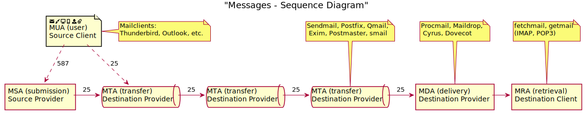
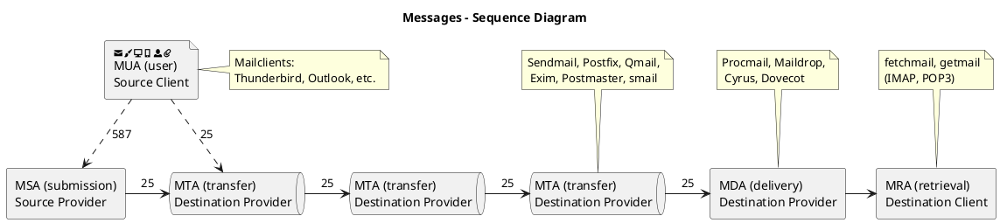

# {{ page.title }}

## 211.1 E-Mail-Server verwenden

Die Prüflinge sollten in der Lage sein, einen E-Mail-Server zu betreiben.
Dies umfasst die Einrichtung von E-Mail-Aliassen, E-Mail-Quotas und virtuellen
E-Mail-Domains. Dieses Lernziel beinhaltet auch die Konfiguration von internen
E-Mail-Relays und die Überwachung des E-Mail-Servers.

**Hauptwissensgebiete:**
-   Konfigurationsdateien von Postfix
-   Grundlegende TLS-Konfiguration von Postfix
-   Grundwissen über das Protokoll SMTP
-   Wissen um Sendmail und Exim

**Dies ist eine auszugsweise Liste der verwendeten Dateien, Begriffe und
Hilfsprogramme:**
-   Konfigurationsdateien und Kommandos für Postfix
-   /etc/postfix/
-   /var/spool/postfix/
-   Sendmail-Kompatibilitätskommandos
-   /etc/aliases
-   Mail-bezogene Protokolldateien in /var/log/

### Begriffe

| Abkürzung | Ausgeschrieben        | Bedeutung                                                                                | Beispiel-Apps                                     | Port (zusätzliche Ports) |
| --------- | --------------------- | ---------------------------------------------------------------------------------------- | ------------------------------------------------- | ------------------------ |
| MUA       | Mail User Agent       | User GUI zum Schreiben und lesen von Emails                                              | Thunderbird, Outlook u.v.m.                       | -                        |
| MSA       | Mail Submission Agent | Übermittlungsserver, setzt u.a. Absenderrichtlinien und Signaturverfahren durch          |                                                   | 587 (25)                 |
| MTA       | Mail Transfer Agent   | Nimmt Mails an (i.d.R. über SMTP) und gibt sie an MDAs weiter                            | Sendmail, Postfix, Qmail, Exim, Postmaster, smail |                          |
| MDA       | Mail Delivery Agent   | Er stellt die Emails zu lokalen Mailboxen zu.                                            | Procmail, Maildrop, Cyrus, Dovecot                |                          |
| MRA       | Mail Retrieval Agent  | ruft Mails von einem Remote-Mail-Server ab und stellt sie dem (local/remote) Postfach zu | fetchmail, getmail                                |                          |




Quellcode der Übersicht ([https://www.planttext.com/](https://www.planttext.com/))




### MTA

**Besonderheiten:**

MTA besitzen eine Queue / Warteschlange, dadurch kann er mehrere Zustellversuche an den im MX-Record Hinterlegten SMTP-Server unternehmen.

**Sicherheit:**

MTA's sind leicht angreifbar und müssen geschützt werden. SPAM-Abwehr ist hier sehr wichtig.

### Installation postfix

```
apt install postfix
```

Info zum installierten Postfix:

```
root@ubuntu:/etc/postfix# man postfix
You have new mail in /var/mail/root
root@ubuntu:/etc/postfix# aptitude show postfix
Package: postfix
Version: 3.3.0-1ubuntu0.2
State: installed
Automatically installed: no
Priority: optional
Section: mail
Maintainer: LaMont Jones <lamont@debian.org>
Architecture: amd64
Uncompressed Size: 4.077 k
Depends: libc6 (>= 2.14), libdb5.3, libicu60 (>= 60.1-1~), libsasl2-2, libssl1.1 (>= 1.1.0), debconf (>= 0.5) | debconf-2.0, netbase, adduser (>= 3.48), dpkg (>= 1.8.3), lsb-base (>= 3.0-6), ssl-cert, cpio, e2fsprogs
Recommends: python3
Suggests: procmail, postfix-mysql, postfix-pgsql, postfix-ldap, postfix-pcre, postfix-lmdb, postfix-sqlite, sasl2-bin, libsasl2-modules, dovecot-common, resolvconf, postfix-cdb, mail-reader, ufw, postfix-doc
Conflicts: mail-transport-agent, mail-transport-agent:i386, smail, smail:i386, postfix:i386
Replaces: mail-transport-agent, mail-transport-agent:i386
Provides: default-mta, mail-transport-agent
Description: Hochleistungs-Mail-Transport-Dienst
 Postfix ist ein Mail-Transport-Dienst von Wietse Venema. Er wurde als Alternative zum weit verbreiteten Sendmail-Programm entwickelt. Postfix soll sowohl schnell, einfach zu verwalten als auch sicher sein, dennoch bietet es
 ausreichende Kompatibilität zu Sendmail, um die Benutzer nicht zu ärgern. Postfix ähnelt Sendmail im Aussehen, jedoch sind beide Programme intern vollkommen unterschiedlich.
 Homepage: http://www.postfix.org                     
```

man-page von postfix: [__postfix__](./man/postfix.html)

Wenn man ein Mail verschicken will, sollte man auch das Paket `mailutils` installieren.

```
apt install mailutils
```

### Konfigurationsdateien des postfix

Wie man in der man-page [__postfix__](./man/postfix.html) lesen kann, stehen die wichtigsten Parameter in der `main.cf` und `master.cf` unter `/etc/postfix`. Dort stehen jedoch nur die Einstellungen, die angepasst wurden. Um die aktuell verwendeten Parameter anzuschauen, verwendet man `postconf`.

Hier mal nach Verzeichniseinstellungen gefilter:

```
root@ubuntu:/etc/postfix# postconf | grep direct
address_verify_map = btree:$data_directory/verify_cache
alternate_config_directories =
command_directory = /usr/sbin
command_execution_directory =
config_directory = /etc/postfix
daemon_directory = /usr/lib/postfix/sbin
data_directory = /var/lib/postfix
execution_directory_expansion_filter = 1234567890!@%-_=+:,./abcdefghijklmnopqrstuvwxyzABCDEFGHIJKLMNOPQRSTUVWXYZ
html_directory = /usr/share/doc/postfix/html
mail_spool_directory = /var/mail
manpage_directory = /usr/share/man
meta_directory = /etc/postfix
multi_instance_directories =
postscreen_cache_map = btree:$data_directory/postscreen_cache
process_id_directory = pid
queue_directory = /var/spool/postfix
readme_directory = no
require_home_directory = no
sample_directory = /etc/postfix
shlib_directory = /usr/lib/postfix
smtp_tls_session_cache_database = btree:${data_directory}/smtp_scache
smtpd_tls_session_cache_database = btree:${data_directory}/smtpd_scache
tls_random_exchange_name = ${data_directory}/prng_exch
```

siehe auch man-page von [__postconf__](./man/postconf.html)

Einige Beispiele zur Verwendung von `postconf`:

| Kommando                            | Erläuterung                                                       |
| ----------------------------------- | ----------------------------------------------------------------- |
| `postconf -n`                       | zeigt Einstellungen, die nicht dem default entsprechen            |
| `postconf -d <varname>`             | zeigt nur den Wert der angegebenen Variable an                    |
| `postconf -e "<varname> = <value>"` | ändert den Wert einer Variablen, danach `postfix reload` aufrufen |


### Arbeiten mit dem postfix

Im täglichen Betrieb kommt es mitunter vor, dass Emails nicht zugestellt werden können. Eine Ursache kann zum Beispiel sein, dass der Domainanteil der Email-Adresse nicht über das DNS aufgelöst werden kann. Ursache könnte sein, dass Aufgrund von Netzwerkproblemen kein DNS-Server erreicht werden konnte, oder schlicht die Domain nicht existiert. Dann können diese Emails nicht zugestellt werden und verbleiben erstmal in der Mail-Queue. Um dem entgegenzuwirken, überwacht man die die Mail-Queue, behebt die Fehler und forciert die erneute Abarbeitung der Queue.

Hier die Manpages zu den Tools die in diesem Fall behilflich sind:

- [__sendmail__](./man/sendmail.html) hier Kommando `mailq`
- [__postsuper__](./man/postsuper.html)
- [__postqueue__](./man/postqueue.html)

Beispiele:

**alle Mails anzeigen, die aktuell in der Queue sind**

```
postqueue -p
# oder
mailq
```

**alle Mails erneut versenden, die aktuell in der Queue sind**

```
postqueue -f
```

**eine bestimmte Mail aus der Queue löschen**

```
postsuper -d <QUEUE-ID>
```

**Mails von einem Absender anzeigen(JSON-Format)**

hier benötigt man noch `jq`

```
postqueue -j | jq -r '.|select(.sender=="root@ubuntu")'
```

bei mir sieht der Output dann wie folgt aus:

```
{
  "queue_name": "deferred",
  "queue_id": "62980613A9",
  "arrival_time": 1577619384,
  "message_size": 300,
  "sender": "root@ubuntu",
  "recipients": [
    {
      "address": "vati123@ubuntu",
      "delay_reason": "user lookup error"
    }
  ]
}
{
  "queue_name": "deferred",
  "queue_id": "8638C613AF",
  "arrival_time": 1577620006,
  "message_size": 330,
  "sender": "root@ubuntu",
  "recipients": [
    {
      "address": "unbekannt@ubuntu",
      "delay_reason": "user lookup error"
    }
  ]
}
```

**queue_id's aller Mails anzeigen lassen, dessen erster Empfänger eine bestimmte Email-Adresse hat**

```
postqueue -j | jq -r '.|select(.recipients[0].address=="vati123@ubuntu")|.queue_id'
=> 62980613A9
```

**alle Emails im json Format ausgeben, die einen bestimmten Empfänger enthalten**

```
root@ubuntu:~# postqueue -j | jq -r '.|select(.recipients[]|contains({"address": "vati123@ubuntu"}))'
{
  "queue_name": "deferred",
  "queue_id": "B3277613BF",
  "arrival_time": 1577622574,
  "message_size": 315,
  "sender": "root@ubuntu",
  "recipients": [
    {
      "address": "test2@ubuntu",
      "delay_reason": "user lookup error"
    },
    {
      "address": "vati123@ubuntu",
      "delay_reason": "user lookup error"
    }
  ]
}
{
  "queue_name": "deferred",
  "queue_id": "62980613A9",
  "arrival_time": 1577619384,
  "message_size": 300,
  "sender": "root@ubuntu",
  "recipients": [
    {
      "address": "vati123@ubuntu",
      "delay_reason": "user lookup error"
    }
  ]
}
```

**Emails eines Empfängers direkt löschen**

```
root@ubuntu:~# postqueue -j | jq -r '.|select(.recipients[]|contains({"address": "vati123@ubuntu"}))|.queue_id'
B3277613BF
62980613A9
root@ubuntu:~# postqueue -p
-Queue ID-  --Size-- ----Arrival Time---- -Sender/Recipient-------
B3277613BF      315 Sun Dec 29 13:29:34  root@ubuntu
                                                           (user lookup error)
                                         test2@ubuntu
                                         vati123@ubuntu

62980613A9      300 Sun Dec 29 12:36:24  root@ubuntu
                                                           (user lookup error)
                                         vati123@ubuntu

8638C613AF      330 Sun Dec 29 12:46:46  root@ubuntu
                                                           (user lookup error)
                                         unbekannt@ubuntu

-- 0 Kbytes in 3 Requests.
root@ubuntu:~# postqueue -j | jq -r '.|select(.recipients[]|contains({"address": "vati123@ubuntu"}))|.queue_id' | xargs -I ID postsuper -d ID
postsuper: B3277613BF: removed
postsuper: Deleted: 1 message
postsuper: 62980613A9: removed
postsuper: Deleted: 1 message
root@ubuntu:~# postqueue -p
-Queue ID-  --Size-- ----Arrival Time---- -Sender/Recipient-------
8638C613AF      330 Sun Dec 29 12:46:46  root@ubuntu
                                                           (user lookup error)
                                         unbekannt@ubuntu

-- 0 Kbytes in 1 Request.
```

### Aliase

#### neuen anlegen:

Datei `/etc/aliases` bearbeiten:

```
aliasname: vorhandenes_postfach
```

Damit das wirksam wird noch das Kommando `newaliases` aufrufen.

<iframe width="840" height="472" src="https://www.youtube.com/embed/Dyju0jv7JpI" frameborder="0" allow="accelerometer; autoplay; encrypted-media; gyroscope; picture-in-picture" allowfullscreen></iframe>

#### Alias leitet in Datei oder auf ein Kommando um

genau wie eben nur mit einer Datei als Ziel:

Datei `/etc/aliases` bearbeiten:

```
mail2file: /tmp/mail2file
```

bzw. ein Kommando als Ziel:

```
mail2command: "|/usr/local/bin/maileater.pl /tmp/mail2command"
```

Das verwendete Perlskript:

```perl
#!/usr/bin/env perl
@in=<stdin>;
$id="";
foreach (@in){
  $id=$1 if (m/Message-Id: <([^>]+)>/)
}
open(my $f, ">>", $ARGV[0]);
print $f "----------$id----------\n";
print $f @in;
close $f;
```


Hier gibt es aber ein Problem mit den Rechten, das wird in [https://stackoverflow.com/questions/13395059/postfix-set-privileges-for-a-certain-command-pipe-alias/13395105](https://stackoverflow.com/questions/13395059/postfix-set-privileges-for-a-certain-command-pipe-alias/13395105) ausführlich diskutiert.

<iframe width="870" height="489" src="https://www.youtube.com/embed/QagzA09sPxI" frameborder="0" allow="accelerometer; autoplay; encrypted-media; gyroscope; picture-in-picture" allowfullscreen></iframe>

#### Alias für Verteilerliste

neue Datei `/etc/verteiler1` mit den Emailadressen der Empfänger anlegen:

```
user@ubuntu
root@ubuntu
```

Datei `/etc/aliases` bearbeiten:

```
verteiler1: :include:/etc/verteiler1
```

Änderung publizieren und testen:

```
# newaliases
# echo verteiler-test | mail -s test verteiler1@ubuntu
```

Logfile pürfen `tail -20 /var/log/mail.log` :

```
Jan  4 18:03:31 ubuntu postfix/qmgr[1128]: 2D36C613C6: from=<root@ubuntu>, size=304, nrcpt=1 (queue active)
Jan  4 18:03:31 ubuntu postfix/cleanup[2896]: 67247613C8: message-id=<20200104165456.2D36C613C6@ubuntu>
Jan  4 18:03:31 ubuntu postfix/qmgr[1128]: 67247613C8: from=<root@ubuntu>, size=423, nrcpt=2 (queue active)
Jan  4 18:03:31 ubuntu postfix/local[2895]: 2D36C613C6: to=<verteiler1@ubuntu>, relay=local, delay=515, delays=515/0.03/0/0.01, dsn=2.0.0, status=sent (forwarded as 67247613C8)
Jan  4 18:03:31 ubuntu postfix/qmgr[1128]: 2D36C613C6: removed
Jan  4 18:03:31 ubuntu postfix/local[2895]: 67247613C8: to=<adm_gaida@ubuntu>, orig_to=<verteiler1@ubuntu>, relay=local, delay=0.01, delays=0/0/0/0, dsn=2.0.0, status=sent (delivered to mailbox)
Jan  4 18:03:31 ubuntu postfix/local[2895]: 67247613C8: to=<root@ubuntu>, orig_to=<verteiler1@ubuntu>, relay=local, delay=0.01, delays=0/0/0/0, dsn=2.0.0, status=sent (delivered to mailbox)
Jan  4 18:03:31 ubuntu postfix/qmgr[1128]: 67247613C8: removed
```

Hier noch zwei MAN-Pages die in diesem Zusammenhang wichtig sind:

- [aliases manpage](./man/aliases.html)
- [local manpage](./man/local.html)

#### Alternative Forwarding

man kann Emails eines Systembenutzers weiterleiten, in dem man die Datei `~/.forward` anlegt und den dort den neuen Empfänger einträgt. Das kann auch jeder User für sich selbst machen.

### weitere Manpages

- [mail manpage](./man/aliases.html)
- [mailq manpage](./man/mailq.html)

### Warteschlange

Die Verzeichnisse und Dateien, die die Warteschlange(n) von postfix ausmachen, befinden sich unter `/var/spool/postfix`. Im allgemeinen findet man Warteschlangen von bestimmten
Systemdiensten unter `/var/spool/<dienstname>`, wie auch rsyslog, cront, aber auch der MTA `exim4`.  

### links

[Postfix Überlick - Bild](https://www.credativ.de/wp-content/uploads/2019/06/Postfix-Overview.png)
[Postfix unter centos6 mit big picture](https://dokuwiki.nausch.org/doku.php/centos:mail_c6:mta_1)
[SRS - Sender Rewriting Scheme](https://dokuwiki.nausch.org/doku.php/centos:mail_c6:mta_14)

[HOME](./)
